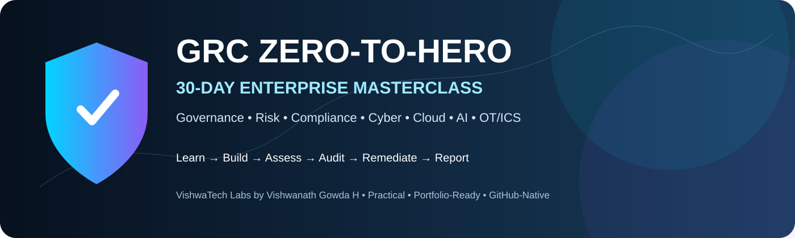
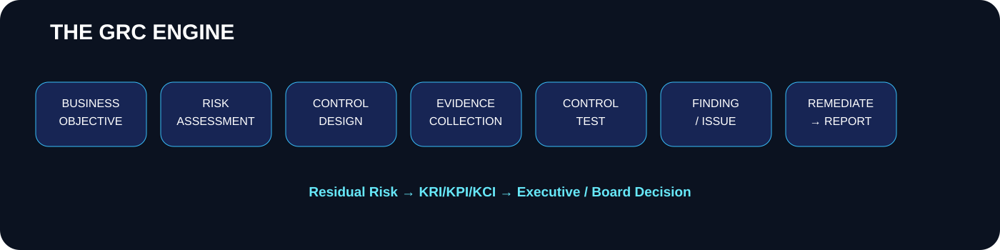
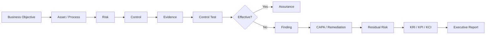
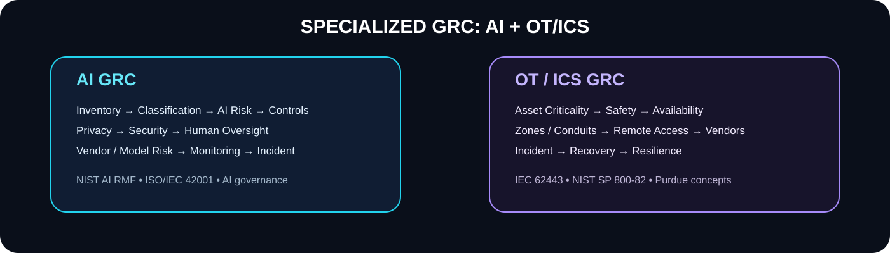

# 🛡️ GRC Zero-to-Hero — Enterprise Edition

### **30 Days • Enterprise GRC • Cybersecurity • Cloud • AI • OT/ICS**

**VishwaTech Labs by Vishwanath Gowda H**

---

## 🌍 Welcome

A **visual, practical, portfolio-first enterprise GRC curriculum**.

> **Business → Risk → Control → Owner → Evidence → Test → Finding → Remediation → Residual Risk → Report**

## 📚 Complete syllabus

**The full syllabus is copied into this repository:** [`SYLLABUS.md`](SYLLABUS.md)

<b>🔥 Expand all 30 days</b>

1. GRC & Cybersecurity Foundations
2. Governance & Operating Model
3. Enterprise Risk Fundamentals
4. Asset, Threat & Business Context
5. Risk Assessment & Quantification
6. Risk Treatment & Exceptions
7. Control Fundamentals
8. Control Testing & Evidence
9. Policies, Standards & Procedures
10. ISO 27001/27002 ISMS
11. NIST CSF / RMF / 800-53
12. CIS Controls + COBIT + ITIL
13. SOC 2 + PCI DSS
14. Privacy & Data Governance
15. Internal Audit & CAPA
16. Third-Party / Vendor Risk
17. Cloud GRC
18. IAM / PAM / IGA GRC
19. SOC / Incident / Vulnerability GRC
20. AppSec / DevSecOps / Supply Chain GRC
21. BCM / DR / Resilience
22. Metrics, KRI/KPI/KCI & Reporting
23. AI Governance & AI GRC
24. OT/ICS GRC
25. Regulatory & Industry GRC
26. GRC Platforms & Automation
27. Enterprise GRC Implementation
28. Capstone Build — Risk & Controls
29. Mock Audit & Executive Simulation
30. Final Capstone, Viva & Career

## 🧠 Visual GRC engine

## 🤖 AI GRC + 🏭 OT/ICS GRC

**AI:** inventory • use-case classification • AI risk • GenAI • shadow AI • privacy • model risk • bias • explainability • human oversight • AI security • third-party AI • AI supply chain • incidents • NIST AI RMF • ISO/IEC 42001 • ISO/IEC 23894.

**OT/ICS:** SCADA • PLC • DCS • HMI • RTU • Purdue • asset criticality • safety • availability • zones/conduits • segmentation • remote/vendor access • resilience • IEC 62443 • NIST SP 800-82.

## 🛠️ Enterprise tool universe

**GRC:** ServiceNow GRC • Archer • IBM OpenPages • MetricStream • AuditBoard • OneTrust

**Cloud:** AWS Security Hub • AWS Config • AWS Audit Manager • CloudTrail • Azure Policy • Defender for Cloud • Entra ID • Google Cloud Security Command Center

**IAM / PAM / IGA:** SailPoint • Saviynt • Okta • Entra ID • CyberArk • BeyondTrust • Ping

**SOC:** Splunk • Microsoft Sentinel • QRadar • Elastic • CrowdStrike

**Vulnerability:** Qualys • Tenable • Rapid7

**AppSec / DevSecOps:** Burp Suite • SonarQube • Snyk • GitHub Actions • Jenkins • Terraform • Docker • Kubernetes • Trivy

**Cloud security:** Wiz • Prisma Cloud

**OT security:** Claroty • Nozomi Networks • Dragos • Defender for IoT • Tenable OT

➡️ [`tools/README.md`](tools/README.md)

## 🧪 Build real artifacts

Risk register • asset register • control library • evidence index • RACI • policies • control tests • risk acceptance • vendor assessment • cloud assessment • IAM assessment • AI inventory • OT inventory • audit report • CAPA • dashboard • board presentation.

➡️ [`labs/`](labs/) • [`templates/`](templates/)

## 🏆 Capstone

**25+ risks → 40+ controls → evidence → testing → findings → CAPA → residual risk → dashboard → board presentation**

➡️ [`capstone/README.md`](capstone/README.md)

## 📡 Live repository signals

The GitHub badges above are dynamic: stars, forks, issues, last commit, license and
Actions status update from the published repository. See [`docs/live-data.md`](docs/live-data.md).

## 🌐 Authoritative resources

- [ISO/IEC 27001](https://www.iso.org/standard/27001)
- [ISO/IEC 42001](https://www.iso.org/standard/42001)
- [NIST CSF](https://www.nist.gov/cyberframework)
- [NIST RMF](https://csrc.nist.gov/Projects/risk-management)
- [NIST AI RMF](https://www.nist.gov/itl/ai-risk-management-framework)
- [NIST AI Resource Center](https://airc.nist.gov/)
- [NIST SP 800-82](https://csrc.nist.gov/pubs/sp/800/82/final)
- [GitHub Actions](https://docs.github.com/en/actions)

## 👨‍🏫 Attribution

**Created and curated for teaching by VishwaTech Labs by Vishwanath Gowda H.**

AI assistance can accelerate drafting, but framework, regulatory and legal content should
be validated against current authoritative sources before professional use.

## ⭐ Learn it. Build it. Audit it. Defend it.

**GRC • CLOUD • AI • OT/ICS • IAM • APPSEC • SOC**
