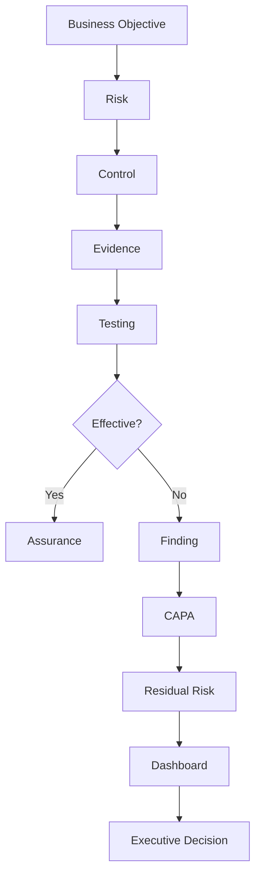
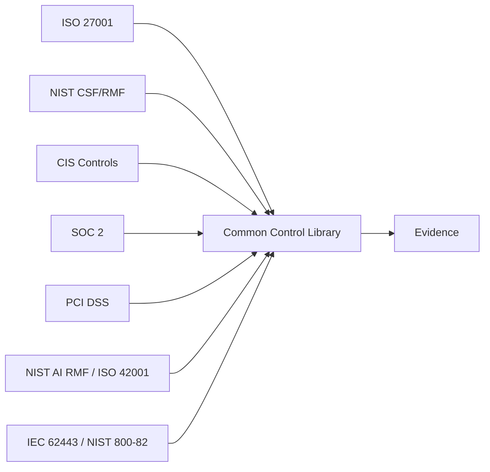

# 🎨 Visual Learning Mode

GitHub renders Mermaid diagrams in Markdown.

```mermaid
flowchart TD
A[Business Objective] --> B[Risk]
B --> C[Control]
C --> D[Evidence]
D --> E[Testing]
E --> F{Effective?}
F -->|Yes| G[Assurance]
F -->|No| H[Finding]
H --> I[CAPA]
I --> J[Residual Risk]
J --> K[Dashboard]
K --> L[Executive Decision]
```

```mermaid
flowchart LR
ISO[ISO 27001] --> C[Common Control Library]
NIST[NIST CSF/RMF] --> C
CIS[CIS Controls] --> C
SOC[SOC 2] --> C
PCI[PCI DSS] --> C
AI[NIST AI RMF / ISO 42001] --> C
OT[IEC 62443 / NIST 800-82] --> C
C --> E[Evidence]
```
